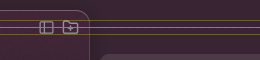
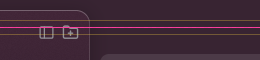

# Header-chip / traffic-light alignment proof

Headless visual proof for the sidebar-header alignment fix: the folders-card
chips and the sessions-list chips now ride the **traffic-light centre line**
instead of being centred in their own 44px strip.

## What the bug was

Two bugs, stacked:

1. `folders_header_chips_at` / `sessions_header_chips_at` centred chips in the
   header strip (`strip_y + strip_h/2`), which is ~4px below the lights.
2. The first fix then put chips on `strip_y + TRAFFIC_LIGHT_ORIGIN +
   TRAFFIC_LIGHT_BTN_H/2` — still wrong, because **macOS draws the traffic
   lights in absolute window coordinates**. `window.set_traffic_light_position`
   (gpui_macos `window.rs:1307` → `state.move_traffic_light()`) is applied to
   the native NSWindow's titlebar, so `TRAFFIC_LIGHT_ORIGIN` (20) is measured
   from the **window top**, while both header strips start `REGION_PAD` (10)
   lower. Measuring the line from `strip.y` therefore parked every chip
   another 10px below the lights — which is why the operator reported the
   icons "went down instead of up" and still were not aligned.

The fix makes `header_chip_y` (`src/workspace.rs`) use the window-relative
line, `(TRAFFIC_LIGHT_ORIGIN + TRAFFIC_LIGHT_BTN_H / 2) * scale`, clamped so
the chip still fits inside the strip. Both clusters use it, `show_folders`
included.

## The measurement is anchored to the window, not to the code

`measure_header_chips.py` derives the expected line from the same two
constants the app uses (`TRAFFIC_LIGHT_ORIGIN`, `TRAFFIC_LIGHT_BTN_H`) but
NOT from the chip layout function, and it adds no `REGION_PAD`. It therefore
measures the pixels against the geometry macOS actually uses. The frames
below were all re-measured with that script after the fix.

## How the frames were captured

macOS draws the traffic lights itself, so the app never paints them — they
cannot appear in a screenshot. The proof therefore overlays the geometry the
app *does* know:

1. `HOME=/tmp/chiprun/home ./target/debug/pwrde` (fake HOME, real run).
2. `pwrde-cli --socket $HOME/.pwrde/worktrees/pwrde/bus.sock resize` twice
   with a 1px delta to force a fresh composited frame (a capture without a
   resize nudge returns a stale frame).
3. `pwrde-cli --socket … screenshot <png>` — the in-app capture, which works
   headlessly (the macOS `screencapture` binary does not).
4. `annotate_header_chips.py` draws the traffic-light band (amber rails,
   y 20..34 at scale 1) and its centre line (pink, y 27) on the frame, and
   the header strip's top edge at y 10 — the band sits *above* the strip top.
5. `measure_header_chips.py` groups bright glyph pixels into clusters and
   reports each cluster's vertical centre against the window-relative line;
   it exits 1 if any cluster is more than 1px off.

All runs below are `scale 1` (1200x721 window), the line is **y = 27**:
worst `|delta|` across every glyph cluster in the strip.

| build | folders-card chips | sessions-list chips | verdict |
| --- | --- | --- | --- |
| branch base (`frame_before.png`) | centre y 31.5, worst delta +5.0px | centre y 31.0, worst delta +4.0px | off the line |
| strip-relative fix (superseded) | centre y 36.5, worst delta +10.0px | centre y 36.0, worst delta +9.0px | further off |
| this branch (`frame_fixed.png`) | centre y 26.5, worst delta +0.5px | centre y 26.5, worst delta +0.5px | on the line |

The remaining half-pixel offsets are glyph rasterisation, not layout: the chip
rects themselves are exactly centred on the line (asserted by
`workspace::tests::header_chips_center_on_the_traffic_light_line`, which also
asserts the premise `list.y == REGION_PAD * scale` and
`light_centre > list.y` so the strip-relative mistake cannot silently return).
The regression check: putting `strip.y` back into `header_chip_y` makes all
three geometry tests fail.

## Files

- `png_profile.py` — stdlib PNG decoder (no PIL in this environment) plus a
  row-brightness profiler.
- `measure_header_chips.py` — glyph-cluster centres vs the centre line.
- `annotate_header_chips.py` — draws the band + centre line onto a frame.
- `header-chips-before.png` (branch base) and `header-chips-after.png`
  (this branch) — the annotated header-strip crops, both against the same
  window-relative line.